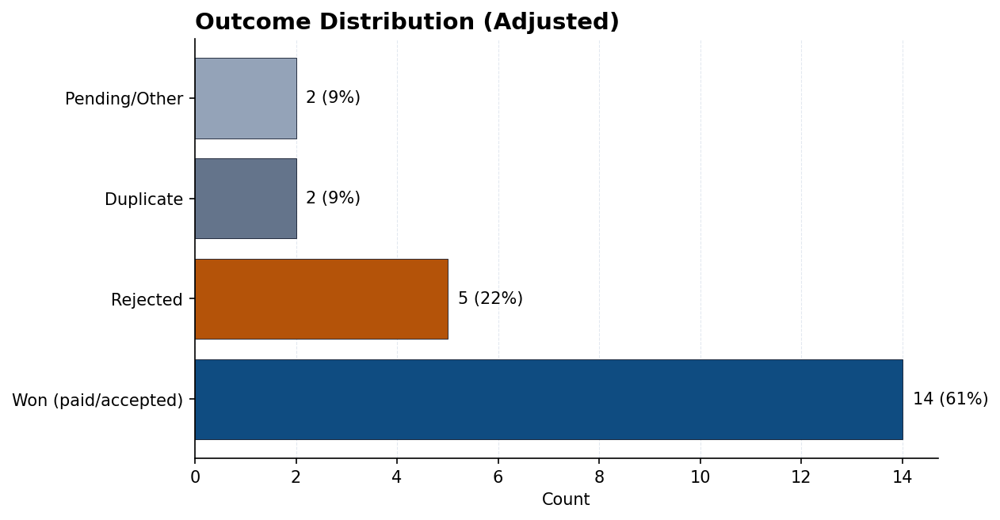
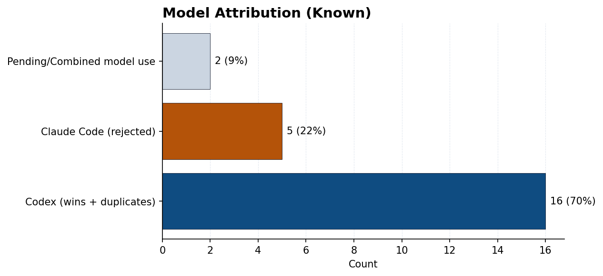

# Bounty Bench

A documentation-only benchmark of my Bugcrowd submissions, written as a technical report. This repository intentionally omits vulnerability details and retains only program names and outcome categories.

## Executive Summary
This report summarizes 23 Bugcrowd submissions with a total of $1,500 in payouts. Outcomes are aggregated and mapped to two tooling setups for comparison. A domain-specific adjustment counts paid ClickHouse submissions as wins even if they remain in a pending or triaged state in the UI.

Key results:
- Wins (paid/accepted) represent 61% of submissions (14 of 23).
- Rejections represent 22% (5 of 23).
- Duplicates represent 9% (2 of 23).
- Pending/Other represents 9% (2 of 23).

## Background
This benchmark tracks outcomes of real submissions to bug bounty programs with the goal of comparing model-assisted workflows. The emphasis is on outcome categories rather than vulnerability specifics to preserve confidentiality and disclosure obligations.

## Research Questions
1. How do outcomes distribute across accepted/paid, rejected, duplicate, and pending categories?
2. How do those outcomes map to model attribution for the two tooling setups?

## Data Source and Scope
- Source: Bugcrowd submissions dashboard snapshots.
- Snapshot window: December 28-30, 2025 and January 12-25, 2026.
- Reporting cut: January 25, 2026.
- Data captured: program names, outcome categories, and payout totals.
- Data excluded: vulnerability details, technical proofs, reproduction steps, and private program metadata.

## Definitions
Outcome categories are standardized as follows:
- Won: Accepted or paid submissions. Includes paid submissions still shown as pending/triaged.
- Rejected: Closed without acceptance.
- Duplicate: Marked duplicate.
- Pending/Other: Any remaining in-progress or unresolved states.

## Attribution Rules
Attribution is assigned at the outcome level:
- codex-5.2-xhigh: Won and Duplicate outcomes.
- opus 4.5 (Claude Code): Rejected outcomes.
- Pending/Combined model use: Pending/Other outcomes.

Special case:
- ClickHouse submissions shown as pending/triaged are counted as Won because payment was issued.

## Methods
Counts are aggregated manually from the UI. Percentages are computed against total submissions (n = 23) and rounded to the nearest whole percent. All findings are non-disclosing and suitable for public documentation.

## Results
### Outcome Summary (Adjusted)
| Outcome | Count | Share of total |
| --- | --- | --- |
| Won (paid/accepted) | 14 | 61% |
| Rejected | 5 | 22% |
| Duplicate | 2 | 9% |
| Pending/Other | 2 | 9% |
| Total | 23 | 100% |

### Model Attribution (Known)
| Model | Count | Share of total |
| --- | --- | --- |
| Codex (wins + duplicates) | 16 | 70% |
| Claude Code (rejected) | 5 | 22% |
| Pending/Combined model use | 2 | 9% |
| Total | 23 | 100% |

### Payouts
- Total payouts: $1,500

### Programs Included
- ClickHouse
- Immutable
- Mattermost
- Origin Energy
- Chipotle
- Internet Brands
- Zendesk
- Octopus Deploy

## Visualizations

### Figure 1. Outcome Distribution (Adjusted)

### Figure 2. Model Attribution (Known)

## Observations
- Claude Code (opus 4.5) is too eager to report issues that end up informational or non-actionable.
- Claude Code is suitable for web app and API testing.
- Codex (codex-5.2-xhigh) performs best when it can read through codebases, especially in open-source repositories.

## Open-Source Notes
- Codex found bugs in open-source repositories. Some are duplicates.
- Disclosures will be made once issues are triaged or closed.

## Limitations
- No vulnerability details are disclosed, which limits external validation.
- No API export was available; the dataset is derived from UI snapshots.
- Some submissions remain unresolved and are reported as Pending/Other.
- Model attribution is a controlled assignment, not an automated attribution system.

## Ethical and Disclosure Considerations
This report is designed to respect program confidentiality and coordinated disclosure timelines. It is intended for high-level benchmarking and does not include technical exploit details or reproducible steps.

## Future Work
- Update counts as pending submissions close.
- Add per-program outcome tallies once disclosure constraints permit.
- Publish redacted writeups after triage/closure approvals.

## Revision Policy
This report will be updated as submissions close and disclosures are permitted.
