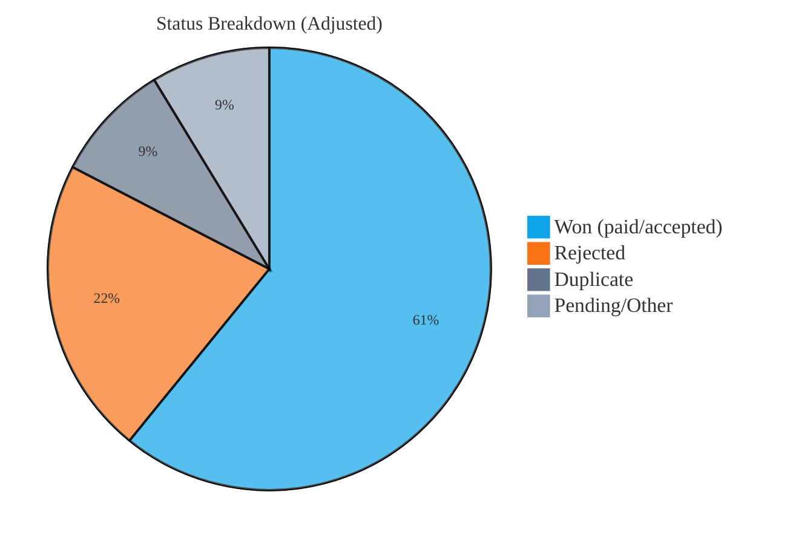
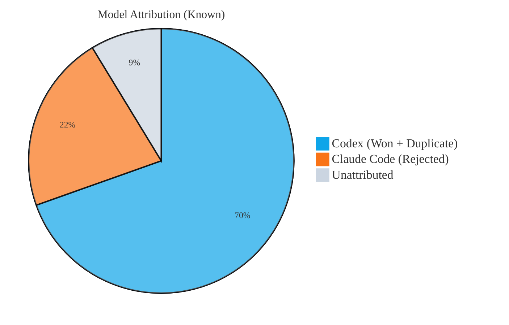
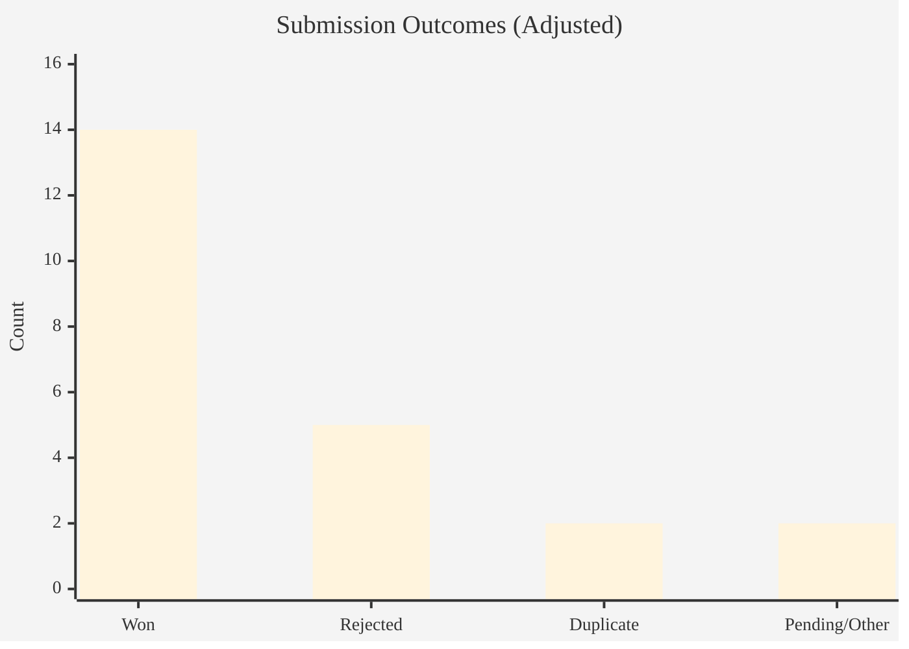

# Bounty Bench

Documentation-only benchmark of my Bugcrowd submissions.
No vulnerability details are disclosed; only program names and outcomes.

## Snapshot (as of January 25, 2026)
- Total submissions: 23
- Total payouts: $1,500

## Attribution Rules
- Rejected = Claude Code (model: opus 4.5; no wins)
- Duplicates = Codex (model: codex-5.2-xhigh)
- Won = Codex (model: codex-5.2-xhigh)
- Pending/Other = Unattributed
- Special case: ClickHouse pending/triaged are treated as Won because they paid

## Programs Included
- ClickHouse
- Immutable
- Mattermost
- Origin Energy
- Chipotle
- Internet Brands
- Zendesk
- Octopus Deploy

## Outcome Summary (Adjusted)
- Won (accepted/paid or paid while pending): 14
- Rejected (Claude Code): 5
- Duplicate (Codex): 2
- Pending/Other (unattributed): 2

## Observations
- Claude Code (opus 4.5) is too eager to report "bugs" that end up informational or not actionable.
- Claude Code is suitable for web app and API testing.
- Codex (codex-5.2-xhigh) shines when it can read through codebases, especially in open-source repos.

## Open-Source Notes
- Codex found bugs in open-source repos. Some are duplicates.
- We will disclose those findings once they are triaged or closed.

## Graphs

### Status Breakdown (Adjusted)

### Model Attribution (Known)

### Outcomes Bar Chart

## Notes
- Counts are based on Bugcrowd dashboard snapshots from December 28-30, 2025 and January 12-25, 2026.
- ClickHouse items shown as triaged/pending are counted as won due to payout.
